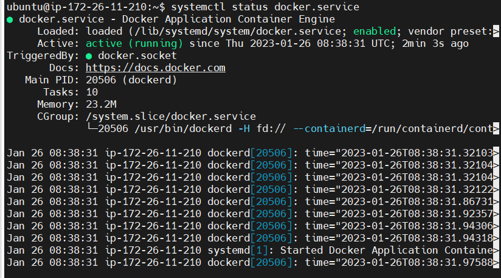
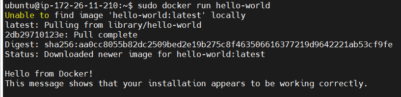

# 도커 설치

### 1. 패키지 툴 업데이트

```jsx
sudo apt-get update
```

### 2. 도커 레포지토리 설치

```jsx
sudo apt-get install ca-certificates curl gnupg lsb-release

sudo mkdir -p /etc/apt/keyrings

curl -fsSL https://download.docker.com/linux/ubuntu/gpg | sudo gpg --dearmor -o
/etc/apt/keyrings/docker.gpg

echo \
 "deb [arch=$(dpkg --print-architecture) signed-by=/etc/apt/keyrings/docker.gpg]
https://download.docker.com/linux/ubuntu \
 $(lsb_release -cs) stable" | sudo tee /etc/apt/sources.list.d/docker.list >
/dev/null

sudo apt-get update
```

### 3. 도커 엔진 설치

```jsx
sudo apt-get install docker-ce docker-ce-cli containerd.io docker-compose-plugin
```

### 4. 실행 확인하기

```jsx
systemctl status docker.service

sudo docker run hello-world
```




